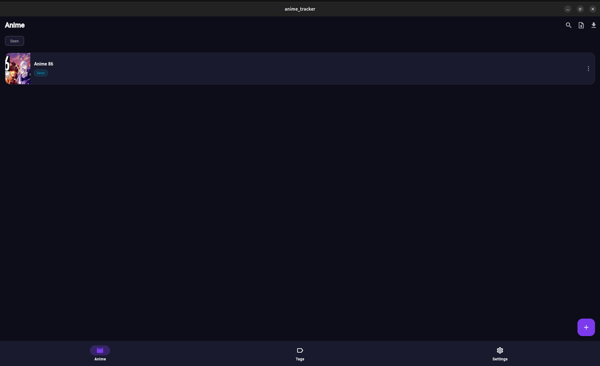
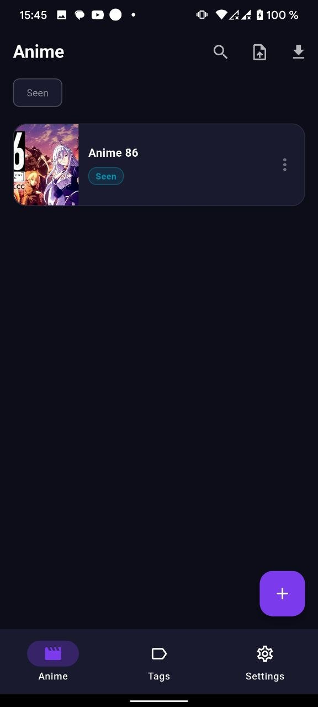

# 🎌 Anime Tracker

> A minimalist app for tracking your anime with a dark theme




## ✨ Features

- 📋 **Anime list** — add, edit, delete entries
- 🏷 **Custom tags** — create tags with colors and assign them to anime
- 🔗 **Watch links** — add custom buttons with links to streaming sites
- 📝 **Notes** — title, description, and personal note for each entry
- 🌍 **12 languages** — EN, RU, UA, DE, FR, ES, JA, ZH, PT, KO, IT, NL
- 💾 **Export / Import** — back up and restore your data via JSON
- 📤 **Share** — share your anime list with friends
- 🌙 **Dark theme** — easy on the eyes

## 🌍 Supported Languages

| Language | Code |
|----------|------|
| English | `en` |
| Русский | `ru` |
| Українська | `ua` |
| Deutsch | `de` |
| Français | `fr` |
| Español | `es` |
| 日本語 | `ja` |
| 中文 | `zh` |
| Português | `pt` |
| 한국어 | `ko` |
| Italiano | `it` |
| Nederlands | `nl` |

## 📱 Platforms

| Platform | Status |
|----------|--------|
| Android | ✅ |
| Linux | ✅ |
| Windows | ✅ |
| iOS / macOS | 🔧 requires Mac |

## 🚀 Getting Started

### Requirements

- Flutter SDK >= 3.11.0
- Dart >= 3.11.0

### Installation

```bash
git clone https://github.com/your-username/anime_tracker.git
cd anime_tracker
flutter pub get
flutter run
```

### Build Android APK

```bash
flutter build apk --release --no-split-per-abi
```

Output: `build/app/outputs/flutter-apk/app-release.apk`

## 📦 Dependencies

| Package | Purpose |
|---------|---------|
| `shared_preferences` | local storage |
| `uuid` | ID generation |
| `file_picker` | export / import files |
| `image_picker` | pick cover images |
| `url_launcher` | open watch links |
| `share_plus` | share anime list |
| `path_provider` | file system access |

## 📁 Project Structure

```
lib/
└── ...              #main code
assets/
├── icon.png         # app icon
└── l10n/            # localization files
    ├── en.yaml
    ├── ru.yaml
    └── ...
```